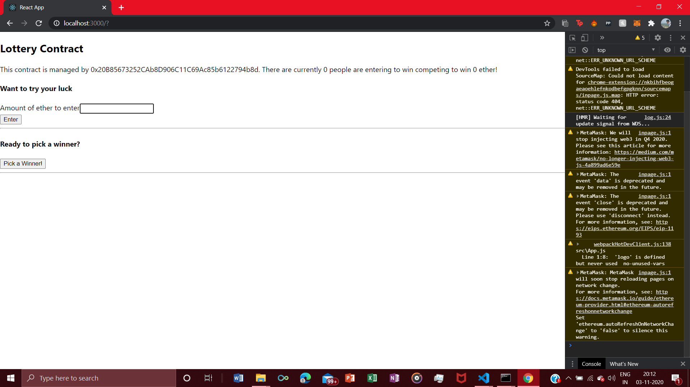
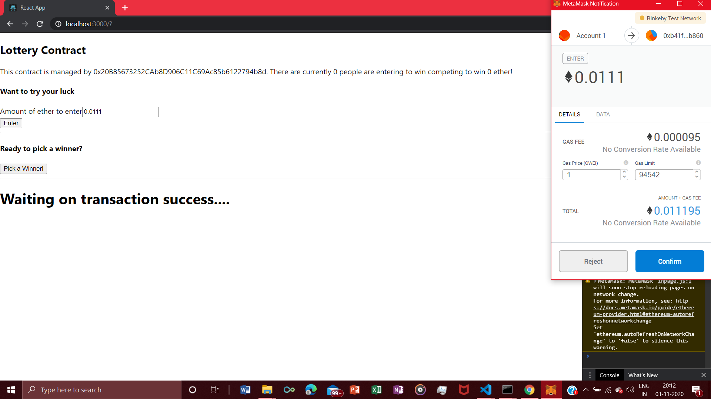
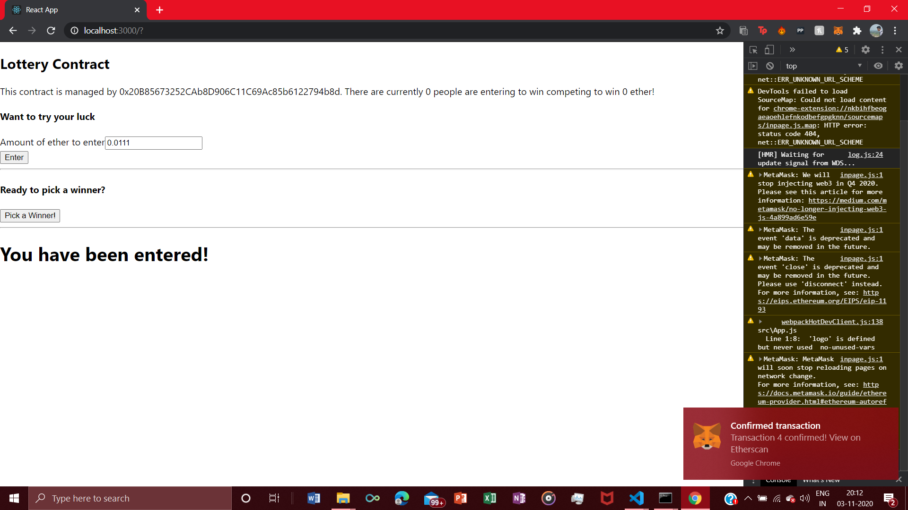

# Lottery-Blockchain

It is a decentralized lottery system made using Blockchain. The frontend of this application is done in Reactjs. The smart contract of this application is done in ethereum network and is deployed in the Rinkeby Test Network. In this application players have to get in the lottery system using minimum of 0.01 ether and a random player is nominated as winner among the players participating and given all the collected ether amount.

Versions used :-

 1) solidity - 0.7.4 (latest ver.)
 
 2) truffle/hdwallet-provider - 1.1.1
 
 3) ganache cli - 6.12.1
 
 4) web3 - 1.0.0-beta.26
 
 5) mocha - 8.2.0
 
 6) React - v17.0
 
 Pictures of the application :- 
 
  
  
  
  
  
  
  

